<h1 align=center>Portfolio Project 4</h1>

Do you love music? Oldies? Pop music?.. 
Well, here you have the opportunity to hear and rate some of your favourite tracks of all time covered, 
(in some peoples opinion, ruined)  
by the worlds most unpopular genre of music.. METAL!

 
 
<h1 align=center>Welcome to Metal-Re-Injection</h1>

## FINAL DESIGN
 
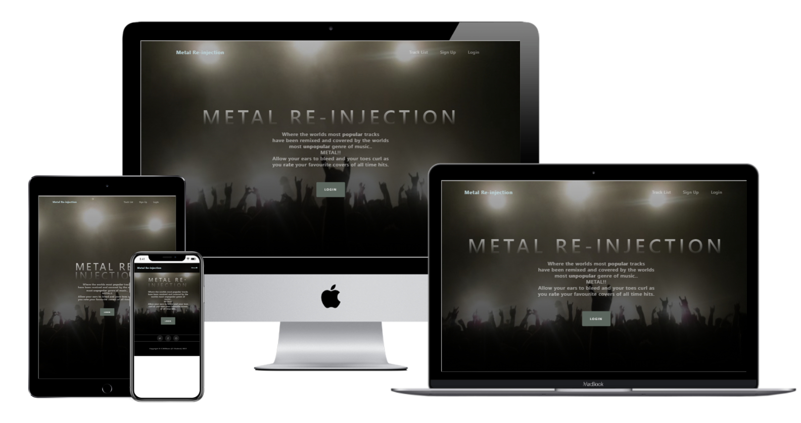

#
[Here is a link to the final project](https://metal-re-injection.herokuapp.com/)
#

## User Experience

### User Stories

1. As a user, I would like to be able to …

    1.1 Register on the website using my username, email address and password;

    1.2 View all tracks added on the site;

    1.3 View details about all added tracks.

    1.4 View tracklist on the navbar.  

2. As a logged in user, I would like to be able to …

    2.1 Create a rating of my favourite tracks, including :
    + Track title,
    + Cover Artist,
    + Original artist,
    + Overall Rating,

    2.2 Create a new track, if my track is not added to the Database;

    2.3 Check my track review after added;

    2.4 Edit or delete my track ratings.
#
### 1. Strategy

  + **Project Goal**

   Create a platform that allows people (users) to rate music covers and share their thoughts in the form of 5 star ratings.

### 2. Scope

 * A simple, straightforward, intuitive UX experience;
 * An explicit content;
 * An easy navigation for the user through all of the features;
 * A site that is visually appealing on most devices.

## Functional Scope 

**Metal-Re-Injection Flowchart**

Flowchart

 

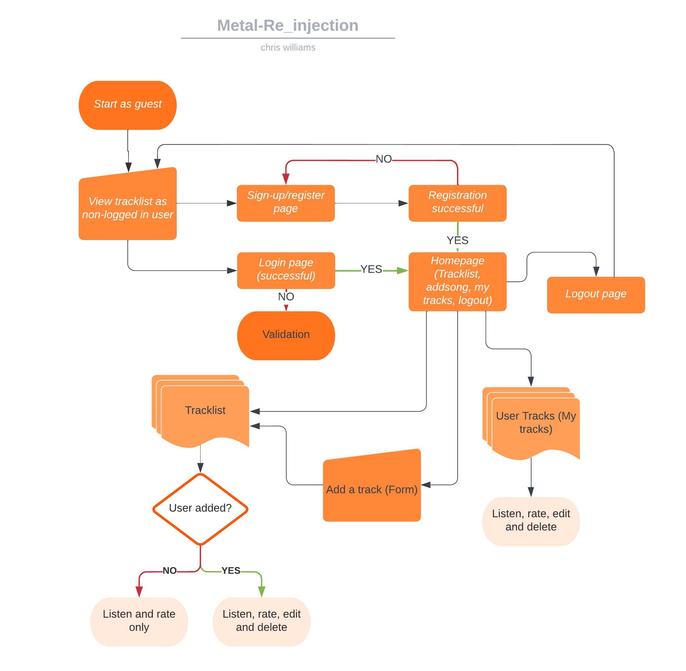

**Agile Methodology**

All functionality and development of this project were managed using **Trello** (https://trello.com/b/LcAoo35I/metal-re-injection-pp4)

* Credentials to this tool will be provided during submission.

<!-- ADD SPRINTS HERE -->
### 3. Structure

* A clear and straightforward layout is in place to ensure users can navigate intuitively and have a leisurely experience.
* Navbar is fixed on top to facilitate users to navigate through pages easily.
* A Small dropdown menu navigation is the same on all pages at small screen sizes to ensure easy navigation.
* Add, Edit/Update are straightforward forms to allow users to use the features without issues.

### 4. Skeleton

* Wireframes created with Balsamiq.  
* The project was developed from initial wireframes, and some modifications were made during the development process in response to user feedback.

Click to see wireframes:

 

[HomePage](wireframes/homepage.png)  
[Add track Page](wireframes/addtrackpage.png)  
[Rating Page](wireframes/ratetrack.png)  
[Register Page](wireframes/registration-page.png)  
[Login Page](wireframes/login-page.png)  
[HomePage mobile](wireframes/home-mobile.png)  
[Add track Page mobile](wireframes/addtrack-mobile.png)  
[Rating Page mobile](wireframes/ratetrack-mobile.png)  
[Register Page mobile](wireframes/registration-mobile.png)  
[Login Page mobile](wireframes/loginpage-mobile.png)  

#

### 5. Surface

* Colours

- The colour scheme was chosen based on the background image I wanted to use sitewide.
I used [Coolors](https://coolors.co/) to generate a colour palette based on the image.

Click to see Colours:

 

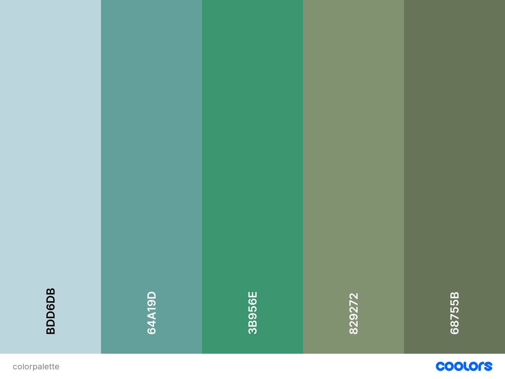 
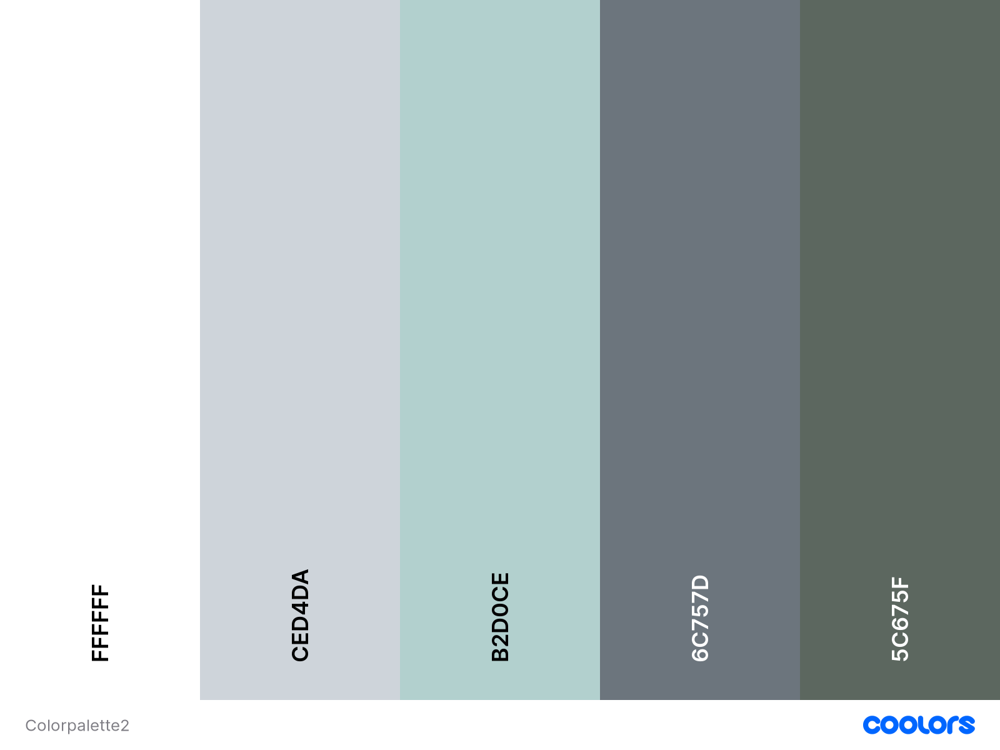

* Font Selection
 
Two fonts were chosen with [Google Fonts](https://fonts.google.com/) to be used across the entire site.

The chosen fonts were Varela Round, Segoe UI with Roboto and Lato as back up fonts for lists, forms, buttons and paragraphs.
#
## Existing Features

### **Navbar**

+ Fixed Navbar allow the user easy access to all pages.

1. Tracklist, Login and Signup buttons on the navbar are the only buttons present if the user is `not` logged in.

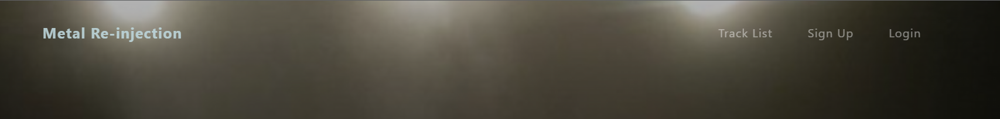

2. Tracklist, Add a Track, My Tracks and Logout buttons are only present if the user has successfully logged in.

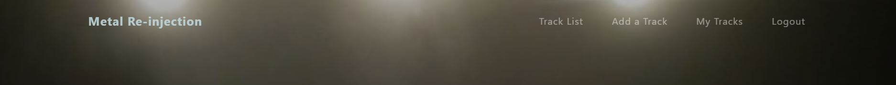

3. Track list is available to view to all users (logged in or not), however, the tracks cannot be played until 
the user logs in, or signs up.

4. Collapsed navbar on smaller devices to wrap in all options and assure better navbar design.

  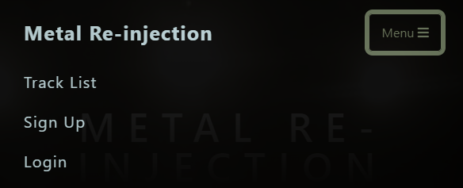

### **Track list page**

1. On this page, users can view all user added tracks ordered by latest date/time added, including pagination.

  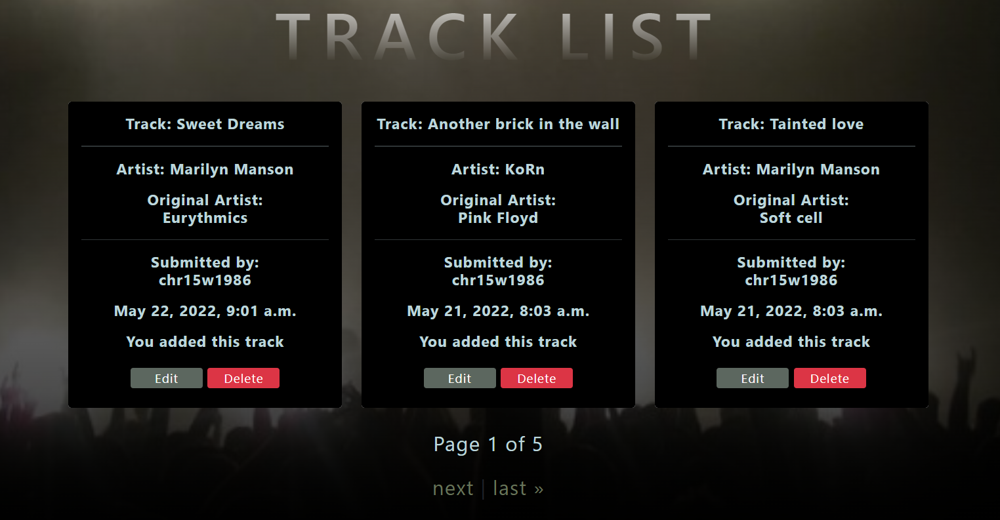

* Each card contains Track title, Cover Artist, Original Artist, Author, Publication date and if the author owns the track, 
two buttons, `Edit` `Delete`.

* The entire card is a link to the Rate a track page.

### **Rate a Track page** 

* Here the User has the ability to listen to the track and give it a rating out of 5 stars.

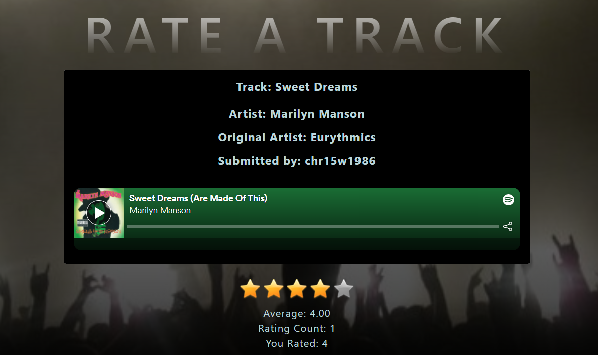

  1.1 If the user is the author, the same `Edit` `Delete` buttons will be present.

   i. Edit Track (highlighted in green)
  
   ii. Delete Track (highlighted in red)

### **Track rating system**

1. Underneath the single song on the `Rate a Track` page, the user has the option to rate the current track out of 5 stars.

    i. The user can rate any song while logged in.
    ii. The user can change their rating while logged in.
    iii. The number of total ratings and average ratings are shown and match the stars accordingly.

  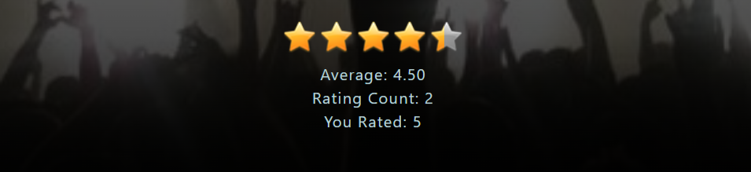

### **Update/Edit Track Page**

1. On this page, a logged user can change the information made by them. All fields are already populated, allowing the user to see which information they would like to change.
2. The `Go back` button will redirect the user to the Rate a Track page without any changes.

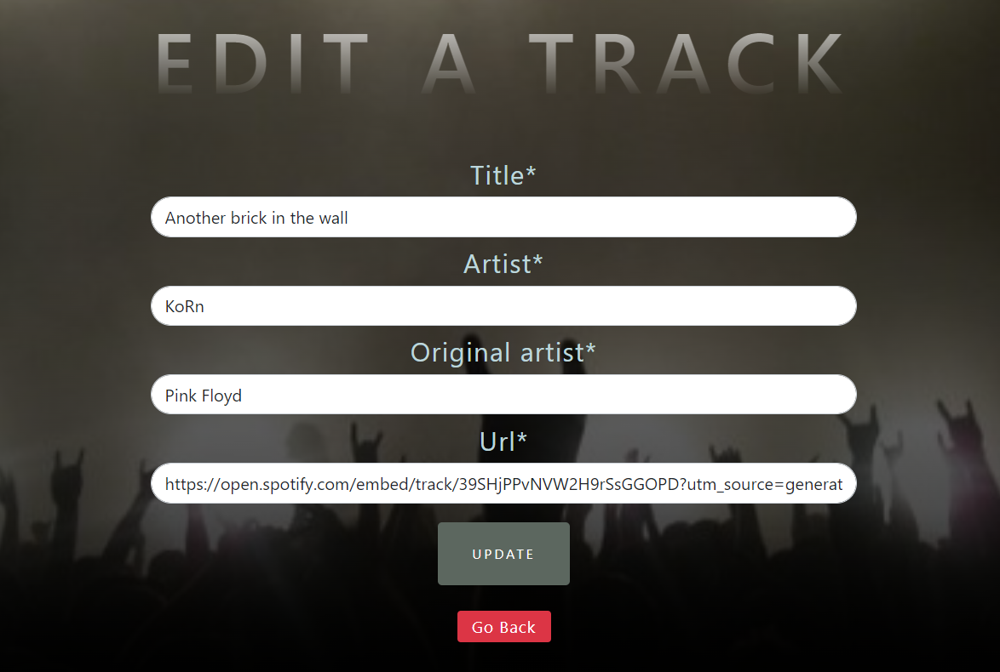

### **Delete a Track Page**

1. If the user clicks on delete a track, they will be redirected to Delete a Track page to confirm the deletion or cancel it.
2. The `Go back` button will redirect the user to the Rate a Track page without any changes.

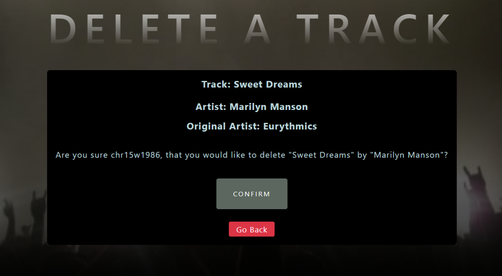

### **Custom 404 Page not found**

* I have created a custom 404 error page to catch if the user inputs the wrong page number, or if a page or feature does not exist.
* I have included a button to redirect back to home.

<!-- IMAGE HERE -->

### **Custom 500 Internal server error**

* I have created a custom 500 error page to redirect to if there are any issues with the database including a button to redirect back to home.

<!-- IMAGE HERE -->
#
## Future Features

I would like to ...

1. Add a infinite smooth scroll carousel to list all tracks on the same page.
2. Add a search bar to find artists and or tracks.
3. Create an option for the user to add a song from another source, i.e. Youtube, Deezer.
4. Include a user profile page allowing users to edit, or delete their profile.
5. Include a comments section to be used with the rating system.

#
## Languages Used

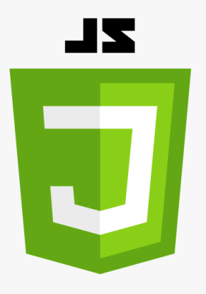

## Frameworks, Libraries & Programs Used

+ Balsamiq: Balsamiq was used to create the wireframes during the design process.
+ Favicon Generator: Used to create favicon used on the website.
+ Grammarly: Used to correct any spell mistakes on readme and app text.
+ Git: Gitpod IDE was used for version control by utilizing the Gitpod terminal to commit and Push to GitHub.
+ GitHub: GitHub respository is used to store the project's code after being pushed from Gitpod.
+ Google Fonts: Google fonts are used to add fonts for aesthetic and UX purposes.
+ Django: Framework used to add structure to the platform.
+ AmIResponsive: Used to generate mockup image.

install django, gunicorn, psycopg2, cloudinary, bootstrap, summernote, allauth, star-ratings, whitenoise