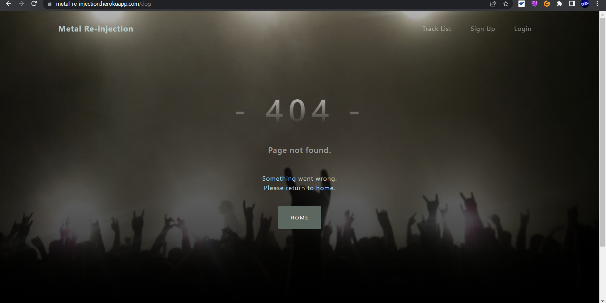
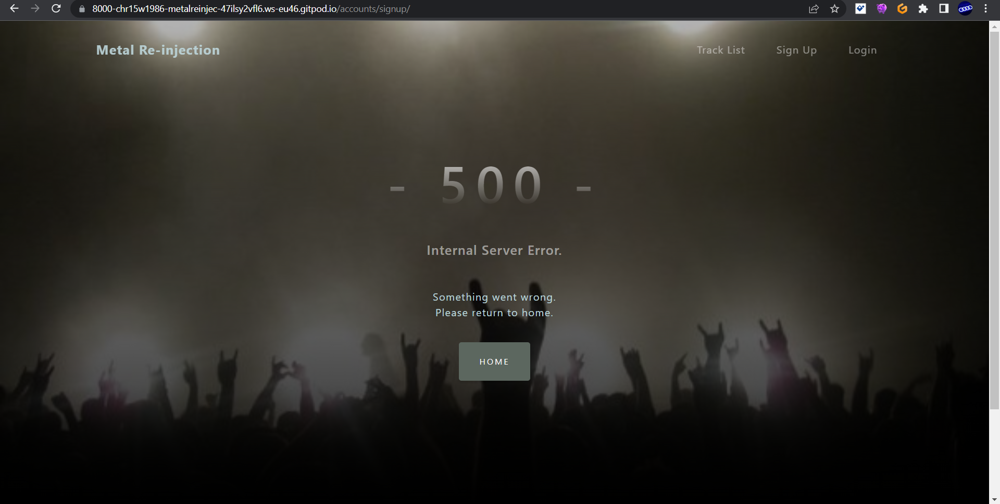
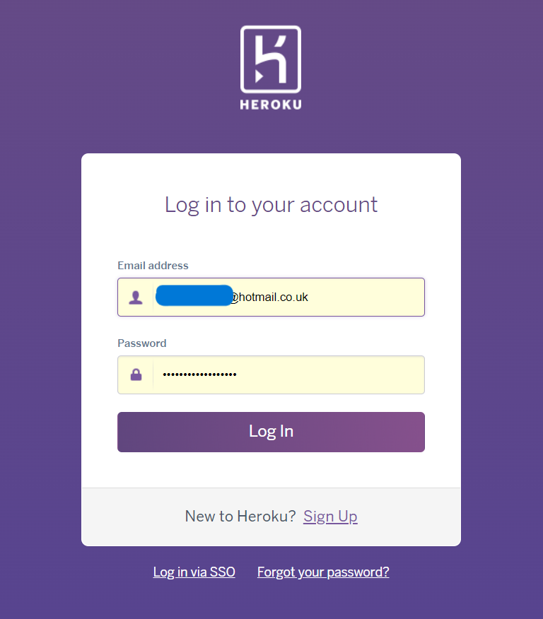
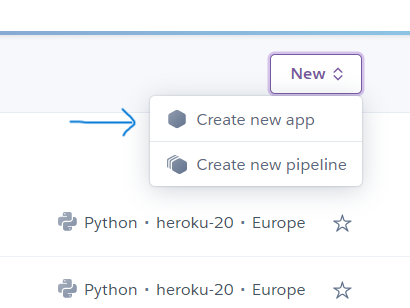
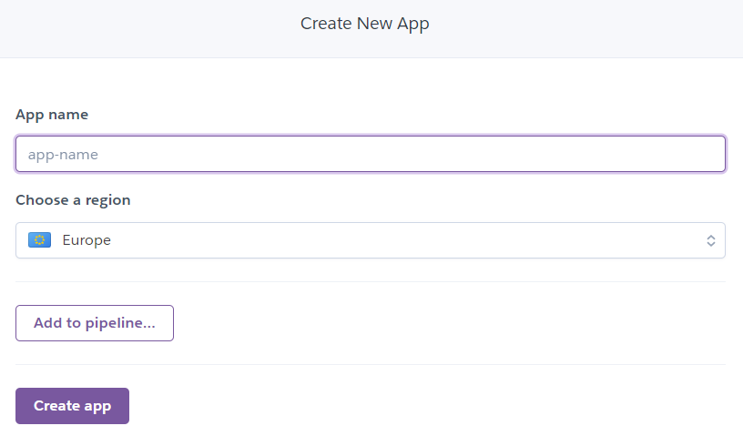
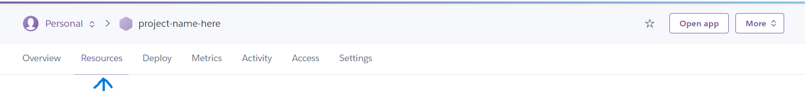
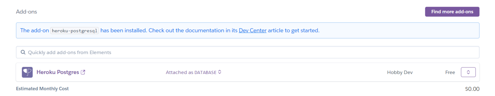
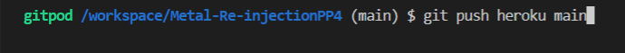
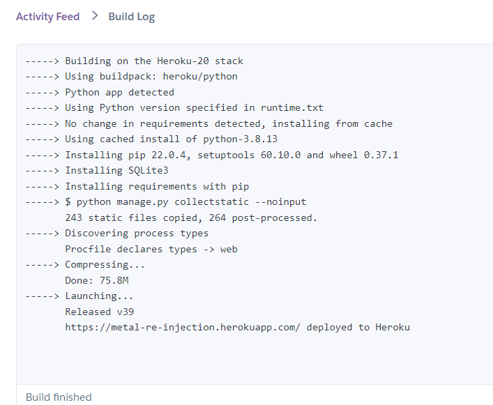
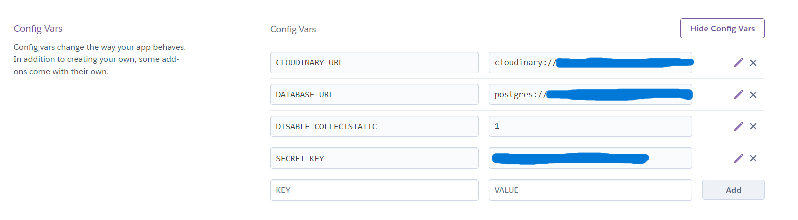

<h1 align=center>Portfolio Project 4</h1>

Do you love music? Oldies? Pop music..? 
Well, here you have the opportunity to hear and rate some of your favourite tracks of all time, covered  
(in some peoples opinion, ruined)  
by the worlds most unpopular genre of music.. METAL!

 
 
<h1 align=center>Welcome to Metal-Re-Injection</h1>

## FINAL DESIGN
 

#
[Here is a link to the final project](https://metal-re-injection.herokuapp.com/)
#

## User Experience

### User Stories

1. As a user, I would like to be able to:

    1.1 Register on the website using my username, email address and password

    1.2 View all tracks added on the site

    1.3 View details about all added tracks

    1.4 View tracklist on the navbar  

2. As a logged in user, I would like to be able to:

    2.1 Create a rating of my favourite tracks, including:
    + Track title
    + Cover Artist
    + Original artist
    + Overall Rating

    2.2 Create a new track, if my track is not added to the Database

    2.3 Check my track review after added

    2.4 Edit or delete my track ratings
#
### 1. Strategy

  + **Project Goal**

   Create a platform that allows people (users) to rate music covers and share their thoughts in the form of 5 star ratings.

### 2. Scope

 * A simple, straightforward, intuitive UX experience
 * An explicit content
 * An easy navigation for the user through all of the features
 * A site that is visually appealing on most devices

## Functional Scope 

**Metal-Re-Injection Flowchart**

Flowchart

 

**Agile Methodology**

All functionality and development of this project were managed using **Trello** (https://trello.com/b/LcAoo35I/metal-re-injection-pp4)

* Credentials to this tool will be provided during submission

### 3. Structure

* A clear and straightforward layout is in place to ensure users can navigate intuitively and have a leisurely experience
* Navbar is fixed on top to facilitate users to navigate through pages easily
* A Small dropdown menu navigation is the same on all pages at small screen sizes to ensure easy navigation
* Add, Edit/Update are straightforward forms to allow users to use the features without issues

### 4. Skeleton

* Wireframes created with Balsamiq.  
* The project was developed from initial wireframes, and some modifications were made during the development process in response to user feedback

Click to see wireframes:

 

[HomePage](wireframes/homepage.png)  
[Add track Page](wireframes/addtrackpage.png)  
[Rating Page](wireframes/ratetrack.png)  
[Register Page](wireframes/registration-page.png)  
[Login Page](wireframes/login-page.png)  
[HomePage mobile](wireframes/home-mobile.png)  
[Add track Page mobile](wireframes/addtrack-mobile.png)  
[Rating Page mobile](wireframes/ratetrack-mobile.png)  
[Register Page mobile](wireframes/registration-mobile.png)  
[Login Page mobile](wireframes/loginpage-mobile.png)  

### 5. Surface

* Colours

- The colour scheme was chosen based on the background image I wanted to use sitewide:
I used [Coolors](https://coolors.co/) to generate a colour palette based on the image.

Click to see Colours:

 

 

**Font Selection**
 
Two fonts were chosen with [Google Fonts](https://fonts.google.com/) to be used across the entire site.

The chosen fonts were Varela Round, Segoe UI with Roboto and Lato as back up fonts for lists, forms, buttons and paragraphs.
#
## Existing Features

### **Navbar**

+ Fixed Navbar to allow the user easy access to all pages

1. Tracklist, Login and Signup buttons on the navbar are the only buttons present if the user is `not` logged in

2. Tracklist, Add a Track, My Tracks and Logout buttons are only present if the user has successfully logged in

3. Track list is available to view to all users (logged in or not), however, the tracks cannot be played until 
the user logs in, or signs up

4. Collapsed navbar on smaller devices to wrap in all options and assure better navbar design

  

### **Track list page**

1. On this page, users can view all user added tracks ordered by latest date/time added, including pagination

  

* Each card contains Track title, Cover Artist, Original Artist, Author, Publication date and if the author owns the track,
two buttons, `Edit` `Delete`

* The entire card is a link to the Rate a track page

### **Rate a Track page** 

* Here the User has the ability to listen to the track and give it a rating out of 5 stars

  1.1 If the user is the author, the same `Edit` `Delete` buttons will be present

   i. Edit Track (highlighted in green)
  
   ii. Delete Track (highlighted in red)

### **Track rating system**

1. Underneath the single song on the `Rate a Track` page, the user has the option to rate the current track out of 5 stars

    i. The user can rate any song while logged in 
    ii. The user can change their rating while logged in 
    iii. The number of total ratings and average ratings are shown and match the stars accordingly

  

### **Update/Edit Track Page**

1. On this page, a logged user can change the information made by them. All fields are prepopulated, allowing the user to see which information they would like to change
2. The `Go back` button will redirect the user to the Rate a Track page without any changes

### **Delete a Track Page**

1. If the user clicks on delete a track, they will be redirected to Delete a Track page to confirm the deletion or cancel it
2. The `Go back` button will redirect the user to the Rate a Track page without any changes

### **Custom 404 Page not found**

* I have created a custom 404 error page to catch if the user inputs the wrong page number, or if a page or feature does not exist
* I have included a button to redirect back to home

### **Custom 500 Internal server error**

* I have created a custom 500 error page to redirect to if there are any issues with the database including a button to redirect back to home

### **Custom 403 Forbidden page**

* I have also created a custom 403 forbidden error page to redirect to if there are any instances where a user tries to access a secure area of the site (e.g admin), including a button to redirect back to home

#
## Future Features

I would like to...

1. Add a search bar to find artists and or tracks
2. Add an infinite smooth scroll carousel to list all tracks on the same page
3. Create an option for the user to add a song from another source, i.e. Youtube, Deezer
4. Include a user profile page allowing users to edit, or delete their profile
5. Include a comments section to be used with the rating system

#
## Languages Used

## Frameworks, Libraries & Programs Used

+ Balsamiq: Balsamiq was used to create the wireframes during the design process
+ Favicon Generator: Used to create favicon used on the website
+ Grammarly: Used to correct any spelling mistakes on readme and app text
+ Git: Gitpod IDE was used for version control by utilizing the Gitpod terminal to commit and Push to GitHub
+ GitHub: GitHub respository is used to store the project's code after being pushed from Gitpod
+ Google Fonts: Google fonts are used to add fonts for aesthetic and UX purposes
+ Django: Framework used to add structure to the platform
+ Bootstrap5: Framework used to add structure and responsiveness
+ AmIResponsive: Used to generate mockup image

## Testing and Code validation

All testing and code validation details are described in a separate file [TESTING.md](TESTING.md)

## Deployment

Metal-Re-Injection is deployed using Heroku

Heroku Deployment steps: 

 1. Ensure all dependencies are listed within the requirements.txt file

 Within the terminal in Gitpod type `pip3 --local freeze > requirements.txt`, and a list with all requirements will be created to be read by Heroku.

 2. Setting up Heroku
  * NB Due to security issues connecting github directly to heroku (at the time this project was deployed),
    first you must log into your heroku account via the terminal in gitpod (more info on this further down).
      
    2.1 Next, navigate to the [Heroku](https://www.heroku.com/) website

    2.2 Login to Heroku
    
    

    2.3 Click on `New` (top right) and Create a new app
    
    
    
    2.4 Choose a project name and set your location
    
    

    2.5. Navigate to the `Resources` tab

    

    2.6. In the `Add ons` section, search for Heroku Postgres and select it on the list
      - A pop up will appear, select, 'Hobby Dev' and click `Submit order form`
    
    
    
    2.7.1. Next, You would usually navigate to the `deploy` tab;
      - Click on connect to Github
      - Search for the repository named Metal-Re-Injection
      - And connect heroku to Github. 
    2.7.2. But, as mentioned above this is not possible for the time being.
      - So instead, In order to connect gitpod to heroku type:
          - `$ heroku login -i`
          - Then enter your heroku credentials,
          - Now you are logged into heroku in Gitpod
          - Once all code is commited and pushed to Github, simply push code from Gitpod to heroku using the command: 
         
          - Heroku will start the build process, this can be viewed under the `Activity` tab 
         
          - Once the build process has completed, navigate to `Open App`
          - The app should now be ready to view
    
    2.8. Navigate to the settings tab
    
    2.9.  Click on Config Vars, and add Cloudinary, Database URL (from Heroku-Postgres) and Secret key
    

Forking the GitHub Repository 

* By forking the GitHub Repository, you will be able to make a copy of the original repository on your own GitHub account, allowing you to view and/or make changes without affecting the original repository by using the following steps:

    - Log in to your own GitHub and locate the GitHub Repository you wish to fork
    - At the top of the Repository (not top of page), just above the "Settings" button on the menu, locate the "Fork" button.
    - You should now have a copy of the original repository in your GitHub account

* Making a Local Clone

    - Log in to your own GitHub and locate the GitHub Repository
    - Under the repository name, click "Clone or download"
    - To clone the repository using HTTPS, under "Clone with HTTPS", copy the link
    - Open Git Bash
    - Change the current working directory to the location where you want the cloned directory to be made
    - Type git clone, and then paste the URL you copied in Step 3

 $ git clone https://github.com/Chr15w1986/Metal-Re-injectionPP4

Press Enter. Your local clone will be created

## Credits and references

### Images

* Background image of a stage viewed from the crowd, [artwanted](https://www.artwanted.com/imageview.cfm?id=872661)

## Acknowledgements

- Code institute for the amazing Tutors on the course
- My brilliant Mentor Ben Kavanagh, [BAK2K3](https://github.com/BAK2K3) for his patience, excellent advice on my code, pushing me back on track
    when I started to lose faith, taking time out of his own day and duties to answer ALL of my questions with absolute perfection, and just generally being a Python God!
- Shellie Downie [ShellieD](https://github.com/shellieD), for her support.. two heads are always better than one!
- Matt Boden [MattBCoding](https://github.com/MattBCoding), for being an absolute God at pointing out the obvious
(and all round genius).
- My family for their support, patience and testing!!
- My wonderful fiancée for being my personal spell checker/grammar police and for listening to me when I needed to rant!
- Everybody on Slack for tips, advice, quick fixes and support
