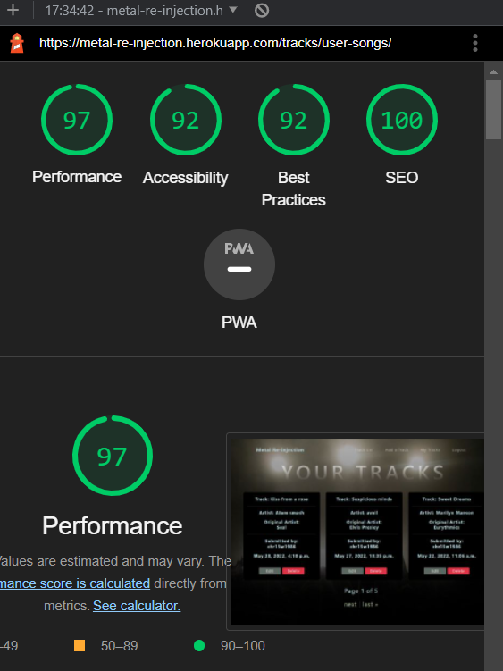
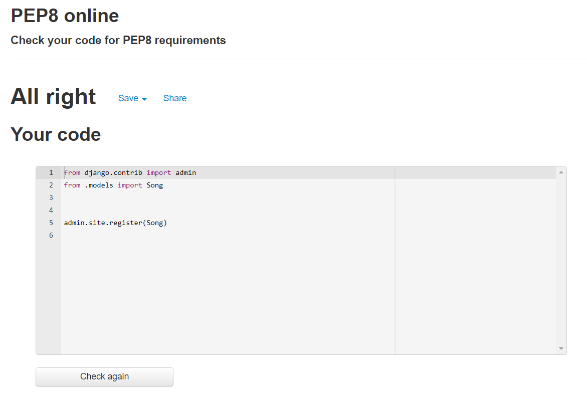
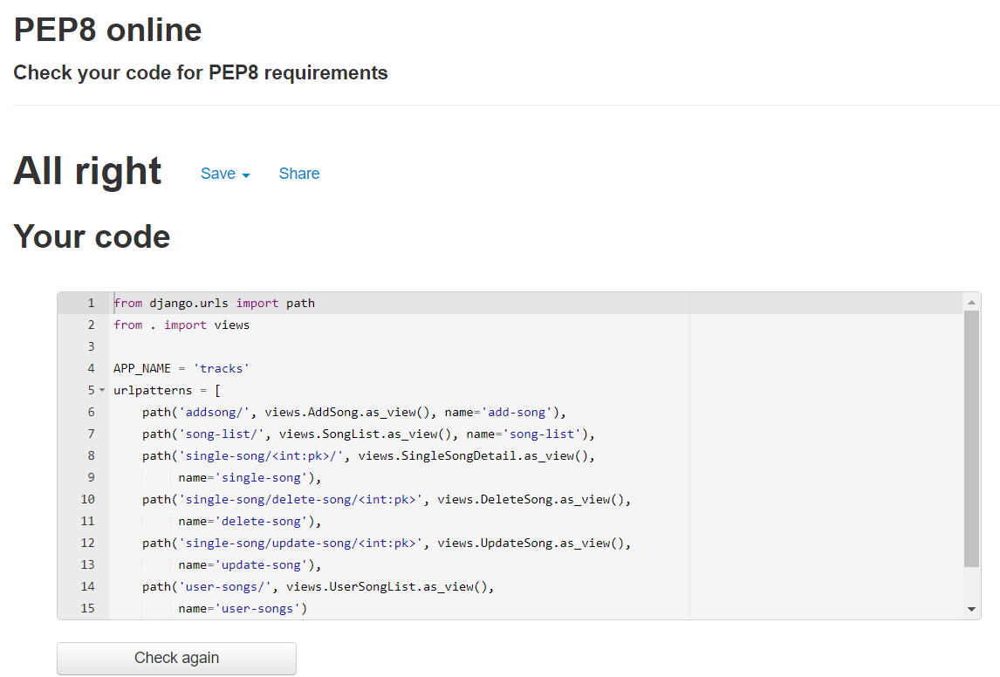

<h1 align=center>Testing</h1>

## **Automated tests**

### **Home app** 

The home app was tested using unittest.
Manual testing was conducted to test anything unittesting didn't cover to ensure no issues remain.

 

### **Tracks app** 

Spotify and add song functions on the tracks app were tested using unit tests.

  * Tracks Unittests Overall

### **Coverage Test**

At the end of the development of this project (phase 1 - before submission day), used coverage tools to assert that automated tests covered all functions.

#
## **Validation and accessibility**

### **Lighthouse report**

  
Reports

  
  All pages of the app were tested using the lighthouse function built in to the Google Chrome browser on incognito mode.
  
  
  
  
  
  
  
  
 
  
  The low score on `Rate a track` with 74 for accessibility, is due to the embedded spotify url.

  
### **WAVE Webaim Accessibility testing**

  
Reports

  ### **Accessibility report**
  The WAVE tool was used to test all pages on the app.
  Some errors repeat over each page tested, these were due to the social links not having text as they are fontawesome links.
  As before a summary of results is shown as well as links to the individual results.  
    
    
  [link to home page WAVE result](https://wave.webaim.org/report#/https://metal-re-injection.herokuapp.com/)  
  [link to login page WAVE result](https://wave.webaim.org/report#/https://metal-re-injection.herokuapp.com/accounts/login/)  
  [link to signup page WAVE result](https://wave.webaim.org/report#/https://metal-re-injection.herokuapp.com/accounts/signup/)  
  [link to tracklist page WAVE result](https://wave.webaim.org/report#/https://metal-re-injection.herokuapp.com/tracks/song-list/)  
  [link to rate a track page WAVE result](https://wave.webaim.org/report#/https://metal-re-injection.herokuapp.com/tracks/single-song/48/)

  There were 2 parts of the site that were inaccesible and due to this I was unable to check them with the tool. 
  * These were:
    - Mytracks page, Internal server error. 
    - Rate a track page, User must be signed in, WAVE wouldn't allow me to sign in.
    

  ### **CSS Validation**
  

  
CSS Validator results

  Only the custom CSS file was tested (style.css)
  
  
  

  
 ### **HTML Validation**  
  

  
HTML Validator results

  All HTML was passed through the validator retreived from the source code within devtools on Chrome.

  [link to w3c validator result](https://validator.w3.org/nu/?showsource=yes&showoutline=yes&showimagereport=yes&doc=https%3A%2F%2Fmetal-re-injection.herokuapp.com%2F)
  
  

  
 ### **Python Validation (PEP8)**
  

  
PEP8 Validator results

###  **Metal-Re-injection App**

        
        
        
        
        

All files for metal-re-injection passed through PEP8 without errors

###  **Home App**

        
        
        

All files for home app passed through PEP8 without errors

### **Tracks App**

        
        
        
        
        
        
        
        

All files for Tracks app passed through PEP8 except one, Tracks/tests.py. 
The errors related to line length, the tested urls in the file cannot be split onto the next line to conform with pylint and pep8,
I do not consider these errors to have any impact on the functionality of the file.

  

#

## **Manual Testing**

### Manual Testing of User Input and Functions  
  I systematically tested all user inputs and functionality in the website to compare feedback/results against expected results.  
  Any unexpected output/outcomes were fixed.  
  [The results of this testing can be found here](https://docs.google.com/spreadsheets/d/1MXG4cFjO-vgku2RB4azp_uSs3hObE3Ms83dnKNmJe8w/edit?usp=sharing)

### Desktop
  
  Google Chrome: All aspects of the site work perfectly fine. Pages load quickly, all features are working and found no problems with CRUD, listening to the tracks, logging in or out, signing up, adding tracks etc.
  Mozilla Firefox: All aspects of the site work perfectly fine. Pages load quickly, all features are working and found no problems with CRUD, listening to the tracks, logging in or out, signing up, adding tracks etc.

  * Every button works and redirects to the next page quickly, 
  * Url's load correctly on the rate a track page. 
  * Sign up form sends an automated email from a gmail account to the user to verify the email address. This works as it should.
  

### Mobile

  Tested all aspects of the site via three devices, Apple Iphone 11, Samsung S20FE and Samsung S7 tablet. The site reacts well to different devices, responsiveness works well, including on apples browser Safari.

# **Unfixed bugs**

  Three errors remain in chrome dev tools on the live version of the site. These errors relate to cloudinary and sitewebmanifest.
  Although I have tried to research this issue, I have not found a cure, thus these errors remain. The functionality of the site is not affected.
